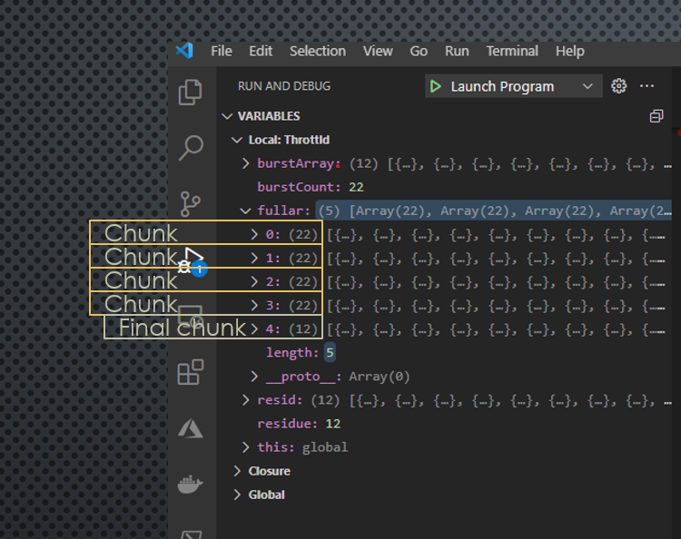
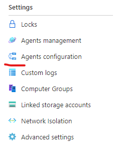

# Split data in array to chunks to be sent for Log Analytics



## test
1. For testing use createTestData.js to create testArray
2. run test.js to see how chunks are created
```javascript
//set fitting throttleSize (In example it is 22)
Throttld(22)
```
## Use with log analytics
1. Get key from log analytics



2. Create key.json in config folder
```
//Not a real key, but similar to show key type etc
{
    "id":"149fecb3-38a3-4800-a14e-a92e3f534efa",
    "key":"K+l6DK2nlDVNuJH5+Lo2fsbWflmYswpBdXYm+9eKoj5pA6armo8TkxERQvweR4ZXtBSXmWar4WWSTFbkpZo48A=="
}
```
## notes
No type or error handling
- Don't use negative throttle-size
- Don't use string as throttle-size

